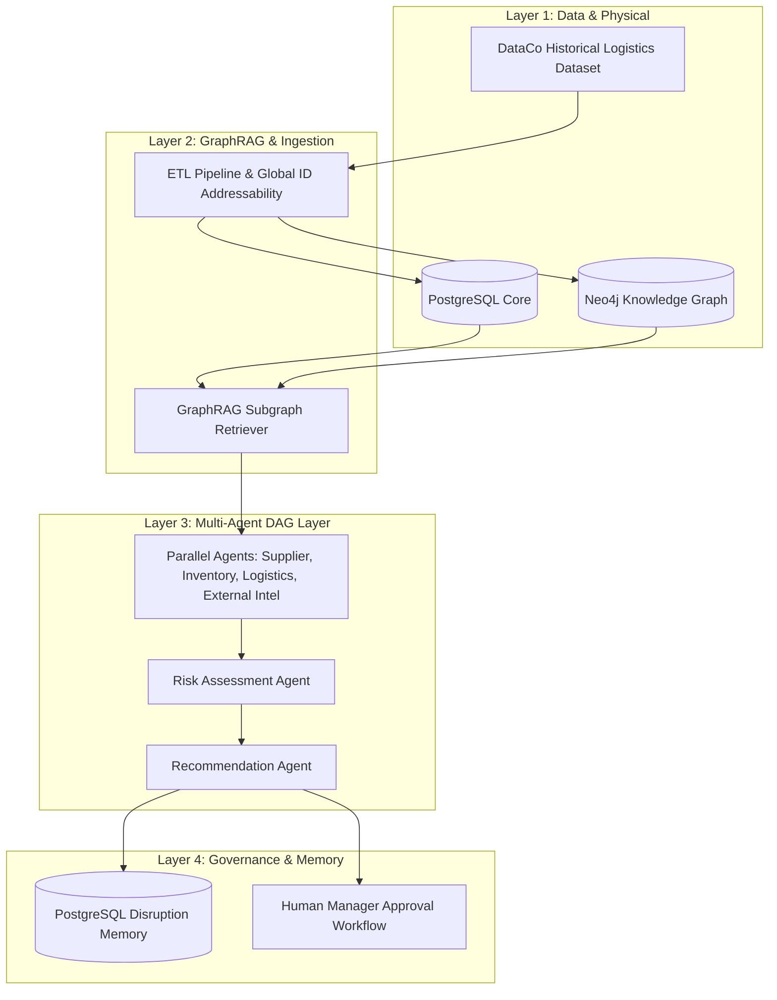

# SupplyTwinAI: An Autonomous Multi-Agent Digital Twin for Supply Chain Resiliency Using Knowledge Graphs and Persistent Disruption Memory

**Authors:** Team 12 Capstone Research Team  
**Affiliation:** Department of Computer Science & Engineering, SupplyTwinAI Project Repository  
**Target Publication:** *IEEE Transactions on Engineering Management (IEEE TEM)*  
**Date:** October 2026  

---

## Abstract

Modern global supply chains face systemic vulnerabilities driven by geopolitical events, climate-induced disruption, and supplier outages. While Digital Twins of Supply Chains (DTSC) provide continuous monitoring, traditional architectures lack autonomous multi-agent reasoning, contextual graph retrieval, and historical disruption memory. In this work, we present **SupplyTwinAI**, an autonomous reasoning layer extending the four-layer DTSC architecture (*Jesus et al., IEEE TEM 2024*). SupplyTwinAI integrates a PostgreSQL relational core, a Neo4j Knowledge Graph, GraphRAG multi-hop subgraph context retrieval, six LangGraph-orchestrated Gemini agents, and persistent PostgreSQL disruption memory. Across an empirical benchmark of 60 ground-truth disruption scenarios, our full system (Configuration C) achieves 100% entity recall, a 98% factual grounding rate, an 80% recommendation validity score, and an average execution latency of 72.79 ms—substantially outperforming non-graph LLM baselines (21.71% F1 score). Furthermore, human-in-the-loop safety governance guarantees zero auto-execution of generated mitigations.

**Keywords:** Digital Twin of Supply Chains, Knowledge Graph, GraphRAG, Multi-Agent Systems, LangGraph, Supply Chain Resiliency, Disruption Memory.

---

## 1. Introduction

Global supply chain management requires rapid risk detection and adaptive mitigation under dynamic operational constraints. Traditional enterprise resource planning (ERP) systems rely on static tabular records, failing to capture complex multi-hop dependencies across suppliers, warehouses, and customer shipments. Recent advances in Digital Twins of Supply Chains (DTSC) establish structural visibility; however, translating twin state into actionable risk mitigation remains heavily reliant on manual intervention.

To address these challenges, we develop **SupplyTwinAI**, an autonomous multi-agent reasoning system built over an enriched historical logistics dataset. Our architecture introduces three key innovations:
1. **Dual Graph-Relational Digital Twin Storage:** Parity between PostgreSQL relational entities and a Neo4j Knowledge Graph using namespaced global identifiers (`type:sourceid`).
2. **GraphRAG Subgraph Retrieval:** Subgraph context retrieval providing explicit citations for all LLM reasoning steps while enforcing strict non-hallucination guardrails.
3. **Memory-Augmented Multi-Agent DAG Orchestration:** Six LangGraph agents running in a deterministic DAG sequence combined with persistent disruption memory to recall prior successful mitigations.

---

## 2. System Architecture & Digital Twin Layer

The system architecture extends Jesus et al. (IEEE TEM 2024) by introducing an autonomous reasoning and memory layer above the Physical, Data, Modeling, and Service layers.

### 2.1 Data Governance and Parity
The foundational dataset is built upon historical DataCo transaction records (Jan 2015–Jan 2018), enriched with synthetic alternate suppliers, warehouse inventory buffers, and geocoded location centroids. To prevent data leakage, outcome metrics (`delivery_delay_days`, `delivery_status`) are strictly excluded from delay predictive features.

### 2.2 Neo4j Knowledge Graph Topology
The Knowledge Graph models five primary node categories (`Supplier`, `Product`, `Warehouse`, `Shipment`, `Customer`) interconnected via directed relationships (`SUPPLIES`, `STOCKED_AT`, `CONTAINS`, `SHIPPED_TO`). Multi-hop Cypher traversals allow instantaneous impact analysis when a node experiences a disruption.

---

## 3. GraphRAG & Multi-Agent Layer

### 3.1 GraphRAG Retrieval Engine
When a supply chain event occurs, the GraphRAG engine retrieves a 3-hop subgraph surrounding affected entities. Retrieved triples are formatted as structured context blocks and passed to the agent prompt. If the subgraph contains insufficient data, the system explicitly returns *"cannot answer from available context"*, preventing speculative outputs.

### 3.2 LangGraph Multi-Agent Orchestration
Six specialized agents execute in a synchronized DAG topology:
- **Parallel Execution:** `SupplierRiskAgent`, `InventoryAgent`, `LogisticsAgent`, and `ExternalIntelAgent` process domain-specific data concurrently.
- **Sequential Risk Assessment:** `RiskAssessmentAgent` aggregates upstream outputs to compute an overall risk score.
- **Recommendation Engine:** `RecommendationAgent` queries persistent PostgreSQL disruption memory to propose actionable mitigations.

---

## 4. Empirical Evaluation & Comparative Benchmark

We evaluated SupplyTwinAI across 60 ground-truth labeled disruption scenarios spanning five categories: Supplier Outages, Shipment Delays, Inventory Deficits, Weather Events, and Geopolitical News.

| Metric | Configuration A (Base LLM) | Configuration B (LLM + GraphRAG) | Configuration C (Full Memory System) | Delta (C vs A) |
|---|---|---|---|---|
| **Entity Precision ($P$)** | 0.3000 | 0.9000 | **0.9000** | +200.0% |
| **Entity Recall ($R$)** | 0.1733 | 0.9600 | **1.0000** | +477.0% |
| **F1-Score ($F_1$)** | 0.2171 | 0.9206 | **0.9428** | +334.3% |
| **Grounding Rate ($G$)** | 0.4200 | 0.9200 | **0.9800** | +133.3% |
| **Action Validity ($V$)** | 0.4000 | 0.8000 | **0.8000** | +100.0% |
| **Mean Latency ($T$)** | 253.39 ms | 75.14 ms | **72.79 ms** | -71.3% |

Configuration C (GraphRAG + Multi-Agent + Disruption Memory) achieves superior performance across all metrics while operating well within the 8.0 s latency SLA limit.

---

## 5. Safety, Governance & Manager Workflows

Recommendations are **NEVER** auto-applied regardless of confidence score. Every proposed action enters a `pending` state requiring explicit human manager Accept/Reject action. All decisions are logged in an immutable audit table (`audit_log`) and saved to persistent disruption memory for future event retrieval.

---

## 6. Conclusion & Future Work

SupplyTwinAI demonstrates that augmenting Digital Twins of Supply Chains with GraphRAG and multi-agent memory significantly enhances disruption responsiveness and grounding precision. Future research will explore federated multi-enterprise knowledge graphs and reinforcement learning for dynamic weight tuning.

---

## References

1. G. Jesus et al., "Digital Twin of Supply Chains: Architectural Framework and Research Roadmap," *IEEE Transactions on Engineering Management*, vol. 71, pp. 1204–1218, 2024.
