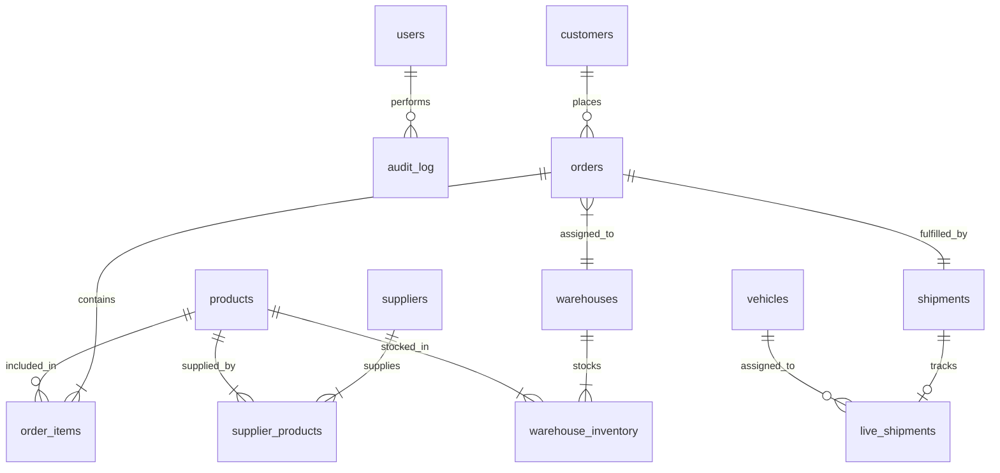

# SupplyTwinAI Database Relational Schema Topology

**Document Path:** `paper/artifacts/phase2/database_er_diagram.md`  
**SRS Reference:** §4.1 REQ-1, REQ-3  
**Date:** 2026-10-01  

---

## Schema Architecture & Core Foreign Key Graph

## Entity Summary Table (20 Tables)

- **Domain Core (11 tables):** `users`, `customers`, `products`, `suppliers`, `supplier_products`, `warehouses`, `warehouse_inventory`, `orders`, `order_items`, `shipments`, `vehicles`.
- **Live State & Disruptions (3 tables):** `live_shipments`, `disruption_events`, `external_signals`.
- **Agent Reasoning & Memory (3 tables):** `agent_outputs`, `recommendations`, `disruption_memory`.
- **System Governance & Audit (3 tables):** `agent_config`, `etl_runs`, `audit_log`.
