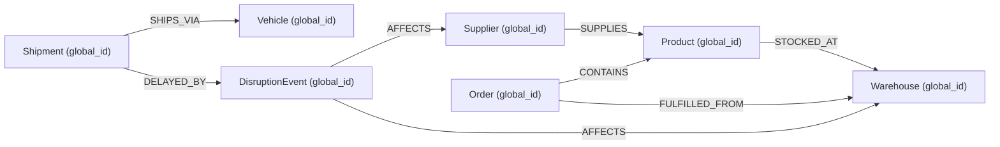

# SupplyTwinAI — Phase 5 Knowledge Graph Schema & Taxonomy

**Artifact Path:** `paper/artifacts/phase5/graph_schema_diagram.md`  
**Phase:** Phase 5 (Knowledge Graph Construction and Knowledge Integration)  
**Database:** Neo4j 5.18.0  

---

## 1. Graph Taxonomy & Node Labels

All entities in the Knowledge Graph are assigned a globally unique namespaced primary key (`global_id` constraint).

| Node Label | Key Properties | Relational Source Table | Constraint Type |
|---|---|---|---|
| `Supplier` | `global_id`, `name`, `on_time_rate`, `defect_rate`, `region`, `is_synthetic` | `suppliers` | `IS UNIQUE (s.global_id)` |
| `Product` | `global_id`, `product_name`, `category`, `unit_price` | `products` | `IS UNIQUE (p.global_id)` |
| `Warehouse` | `global_id`, `name`, `region`, `latitude`, `longitude`, `capacity` | `warehouses` | `IS UNIQUE (w.global_id)` |
| `Order` | `global_id`, `order_status`, `market`, `order_region` | `orders` | `IS UNIQUE (o.global_id)` |
| `Shipment` | `global_id`, `shipping_mode`, `days_scheduled`, `delivery_status` | `shipments` | `IS UNIQUE (sh.global_id)` |
| `Vehicle` | `global_id`, `vehicle_type`, `status` | `vehicles` | `IS UNIQUE (v.global_id)` |
| `DisruptionEvent` | `global_id`, `scenario_id`, `event_type`, `severity`, `status` | `disruption_events` | `IS UNIQUE (de.global_id)` |

---

## 2. Relationship Edge Topology



---

## 3. Multi-Hop Cypher Traversal Specification ($\ge 3$ Hops)

```cypher
// 4-Hop Impact Chain Traversal Query (Supplier Failure -> Downstream Impacted Shipments)
MATCH path = (s:Supplier {global_id: $supplier_global_id})
             -[:SUPPLIES]->(p:Product)
             -[:STOCKED_AT]->(w:Warehouse)
             <-[:FULFILLED_FROM]-(o:Order)
             <-[:CONTAINS]-(p2:Product)
RETURN path, length(path) AS hop_depth
ORDER BY hop_depth ASC;
```
