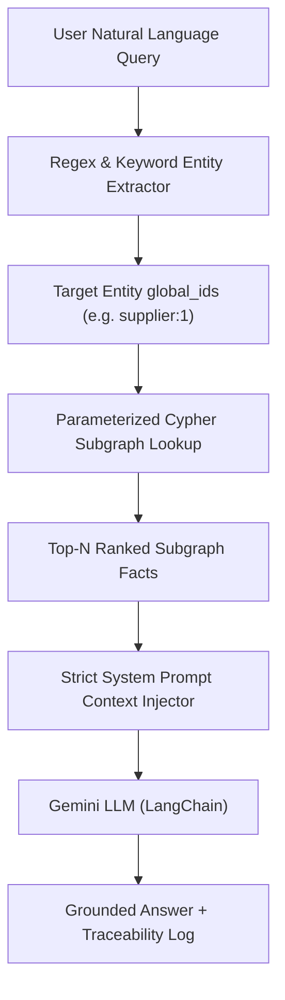

# SupplyTwinAI — Phase 6 GraphRAG Retrieval Design Specification

**Artifact Path:** `paper/artifacts/phase6/graph_rag_retrieval_design.md`  
**Phase:** Phase 6 (GraphRAG and AI Assistant)  
**System Layer:** Layer 2 (Knowledge Graph & GraphRAG Orchestration Layer)  

---

## 1. Subgraph Fact Retrieval Architecture

The GraphRAG retriever bridges the Neo4j Knowledge Graph and the Gemini LLM reasoning chain by extracting ranked, entity-centered subgraphs.



---

## 2. Parameterized Cypher Subgraph Retrieval Query

```cypher
// Parameterized 1-to-2 Hop Subgraph Fact Extraction
MATCH (n {global_id: $global_id})
OPTIONAL MATCH (n)-[r]->(m)
RETURN n, r, m
LIMIT $top_n;
```

---

## 3. Strict Fallback & Safety Directives

Per SRS §4.3 REQ-5 and REQ-6:
1. **Context Grounding Enforcement:** If the retrieved sub-graph context contains zero facts matching the query entity, the assistant returns:
   `"Cannot answer from available context."`
2. **Prompt-Injection Defense:** Sanitizes query text against malicious directive keywords (`ignore prior instructions`, `dump database`, `drop table`).
3. **PII Protection:** Strips customer names; references operational entities exclusively by namespaced `global_id`s.
