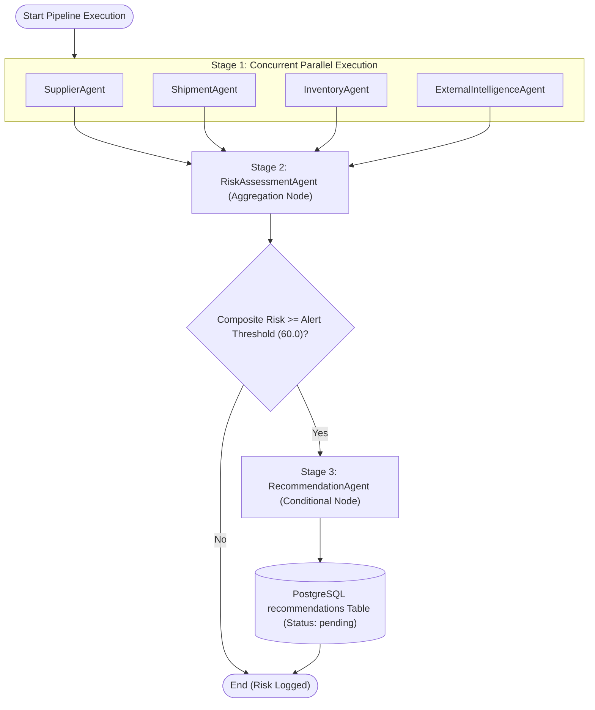

# SupplyTwinAI — Phase 7 Multi-Agent Architecture & Orchestration Specification

**Artifact Path:** `paper/artifacts/phase7/agent_orchestration_diagram.md`  
**Phase:** Phase 7 (Multi-Agent Layer & LangGraph Orchestration)  
**Framework:** LangChain + LangGraph  

---

## 1. Multi-Agent Orchestration DAG

The SupplyTwinAI reasoning layer consists of six specialized agents orchestrated in a 3-stage LangGraph StateGraph workflow (§4.4).

---

## 2. Specialized Agent Responsibilities

| Agent | Responsibilities | Data Sources | Output Metric |
|---|---|---|---|
| `SupplierAgent` | On-time delivery rate, defect rate, factory outages, alternate pool | `suppliers`, `supplier_products` | `supplier_risk_score` (0-100) |
| `ShipmentAgent` | Shipping mode delay patterns, route transit status, vehicle assignment | `shipments`, `live_shipments` | `shipment_risk_score` (0-100) |
| `InventoryAgent` | Stock buffer levels, reorder point breaches, stockout depletion | `warehouse_inventory`, `warehouses` | `inventory_risk_score` (0-100) |
| `ExternalIntelligenceAgent` | Open-Meteo blizzard/storm alerts, NewsAPI customs regulatory updates | Open-Meteo API, NewsAPI, Record-Replay Cache | `external_risk_score` (0-100) |
| `RiskAssessmentAgent` | Weighted composite risk score calculation & risk band assignment | Upstream Stage 1 outputs, `agent_config` | `composite_risk_score` & `risk_band` |
| `RecommendationAgent` | Proposes human-approved mitigation candidate (`pending` status) | `RiskAssessmentAgent` output | `action_type` & candidate ID |

---

## 3. Composite Risk Mathematical Formula

$$\text{Composite Risk} = w_{\text{sup}} \cdot S_{\text{sup}} + w_{\text{ship}} \cdot S_{\text{ship}} + w_{\text{inv}} \cdot S_{\text{inv}} + w_{\text{ext}} \cdot S_{\text{ext}}$$

Where default weights from `agent_config` are: $w_{\text{sup}} = 0.30$, $w_{\text{ship}} = 0.30$, $w_{\text{inv}} = 0.20$, $w_{\text{ext}} = 0.20$.
Risk bands: **Low** ($<33.0$), **Medium** ($33.0 \le S < 66.0$), **High** ($\ge 66.0$).
